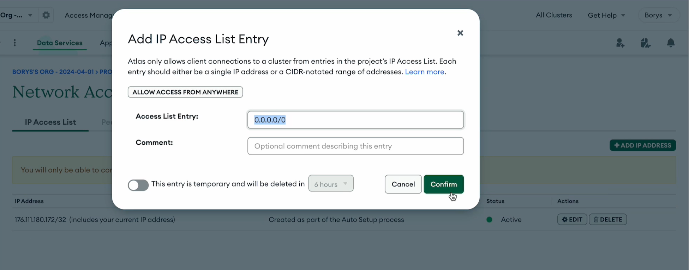

# Welcome!

You are ready for the next stage! This second homework assignment will give you more practical experience working with Node.js.

During this homework, you will create a server to manage a collection of contacts via HTTP requests. You will start by initializing the project, set up the server, connect to MongoDB, and create routes to manage contacts. Don’t forget to deploy your application on [render.com](https://render.com/).

This time, we also prepared a step-by-step guide for you. Each step of this assignment will give you new experience and help you understand how HTTP requests work in a Node.js environment.

Don’t waste time — Go practice! 🚀

---

## Assignment

You need to create an application to manage a collection of contacts, where you can use HTTP requests to retrieve data for all contacts or a single contact by ID.

Data file for import:

[contacts.json](https://drive.google.com/file/d/1-5bjEGcT99Y3OMeTuqGlVo_LhDPauo7i/view)

---

## Acceptance Criteria

- A repository `nodejs-hw-mongodb` is created
- The assignment is completed on the branch `hw2-mongodb`
- When submitting the homework, provide links to the source files on GitHub and a link to the deployed project of this homework (branch `hw2-mongodb`) on [render.com](https://render.com/)
- The code runs without errors

---

## Step-by-Step Instructions

### Step 1

Initialize the project with:

npm init -y

Add `eslint` to the project dependencies and adjust its configuration file according to the example provided in the Module 1 materials under “Configuration Files”.

Add `.gitignore` and `.prettierrc` files to the project root with the appropriate content.

Install `nodemon` as a development dependency. Add a `"dev"` script in your `package.json` to run the server using nodemon. Edit the `scripts` section as follows:

"dev": "nodemon src/index.js"

---

### Step 2

Create a folder `src` in the project root.

Inside `src`, create a file named `server.js`. This file will contain the logic of your Express server.

In `src/server.js`, create a function `setupServer` which will initialize the Express server. This function should include:

- Creating the server using `express()`
- Configuring [cors](https://www.npmjs.com/package/cors) and the [pino](https://github.com/pinojs/pino-http) logger
- Handling non-existing routes (returning a 404 status and the following message)

```js
{
  message: 'Not found',
}
```

4. Start the server on the port specified by the `PORT` environment variable, or use `3000` if no variable is set.

5. Upon successful server startup, log the following message to the console:  
   “Server is running on port {PORT}”, where `{PORT}` is the port number.

Don’t forget to define the environment variable in the `.env.example` file.

Create a file `src/index.js`. Import and call the `setupServer` function in this file.

---

### Step 3

Create your MongoDB cluster and a function `initMongoConnection` to establish a connection in a separate file `src/db/initMongoConnection.js`.

When creating a cluster in MongoDB Atlas, make sure to configure network access to allow connections from any IP address. To do this:

- Log in to your MongoDB Atlas account and go to your project.
- Select your cluster or create a new one.
- Go to the "Network Access" section.
- Add a new IP address entry by clicking "+ ADD IP ADDRESS".
- In the dialog, choose "ALLOW ACCESS FROM ANYWHERE" or enter `0.0.0.0/0` in the "Access List Entry" field. This will allow connections to your cluster from any IP address.
- Optionally, add a comment and click "Confirm".



Upon successfully connecting to your MongoDB database, log the following message to the console:

"Mongo connection successfully established!"

Database connection details should be stored in the following environment variables:

MONGODB_USER  
MONGODB_PASSWORD  
MONGODB_URL  
MONGODB_DB

Include these variables in your `.env.example` file.

Use the [mongoose](https://www.npmjs.com/package/mongoose) package to work with MongoDB.

In `src/index.js`, call the `initMongoConnection` function. Make sure the database connection is established before starting the server.

---

### Step 4

Contact fields:

- `name` — string, required
- `phoneNumber` — string, required
- `email` — string
- `isFavourite` — boolean, default: false
- `contactType` — string, enum('work', 'home', 'personal'), required, default: 'personal'

To automatically generate `createdAt` and `updatedAt` fields, use `timestamps: true` when creating the model. This adds `createdAt` (creation date) and `updatedAt` (update date) to the object, so you do not need to add them manually.

---

[contacts.json](https://drive.google.com/file/d/1-5bjEGcT99Y3OMeTuqGlVo_LhDPauo7i/view)

Import the default set of contacts from `contacts.json` into your database using any UI (browser, MongoDB Compass, etc.). Make sure the collection name in your model code matches the name in the visual interface.

---

### Step 5

Create the route `GET /contacts` to return an array of all contacts. Handling this route should include:

- Registering the route in `src/server.js`
- Writing the controller for this route
- Creating a service in `src/services` in a file named after the entity (in this case, `contacts.js`)

The server response should return an object with the following properties:

```js
{
  status: 200,
  message: "Successfully found contacts!",
  data:
    // data returned by the request
}
```

### Step 6

Create the route `GET /contacts/:contactId`, which will return the contact data for the provided ID, or return a 404 error if the contact is not found. Handling this route should include:

- Registering the route in `src/server.js`
- Writing the controller for this route
- Creating a service in the `src/services` folder in a file named after the entity (in this case, `contacts.js`)

If the contact is found, the server response should have a status of 200 and return an object with the following properties:

```js
{
  status: 200,
  message: "Successfully found contact with id {contactId}!",
  data: {
    // contact object
  }
}
```

Add a check to see if a contact with the provided ID was found. If the contact is not found, return a response with a 404 status and the following object:

```js
{
  message: 'Contact not found',
}
```

At this stage, you do not need to validate an invalid MongoDB ID in this module. We assume that the ID is always valid.

---

### Step 7

Deploy your application from the `hw2-mongodb` branch to [render.com](https://render.com). A step-by-step guide on how to do this can be found in this video:

https://github.com/user-attachments/assets/da3a1cad-f216-4c37-accd-ee7a8099d834

It is very important to check your deployed application on render.com before submitting your homework to the mentor.

For example, if you forgot to add environment variables (env) during deployment, the backend will not work. Also, make sure that all backend routes you created are functioning as expected according to the assignment.

---

**Live page: [GitHub Pages](https://nodejs-hw-mongodb-2-aq4q.onrender.com/)**
